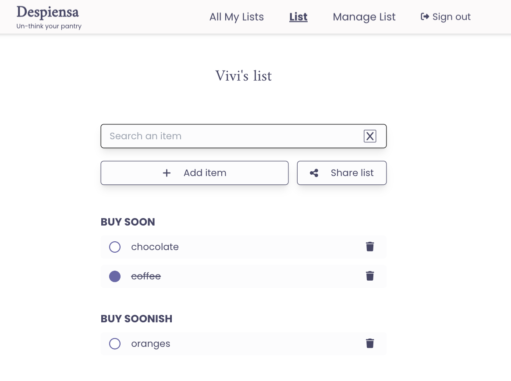
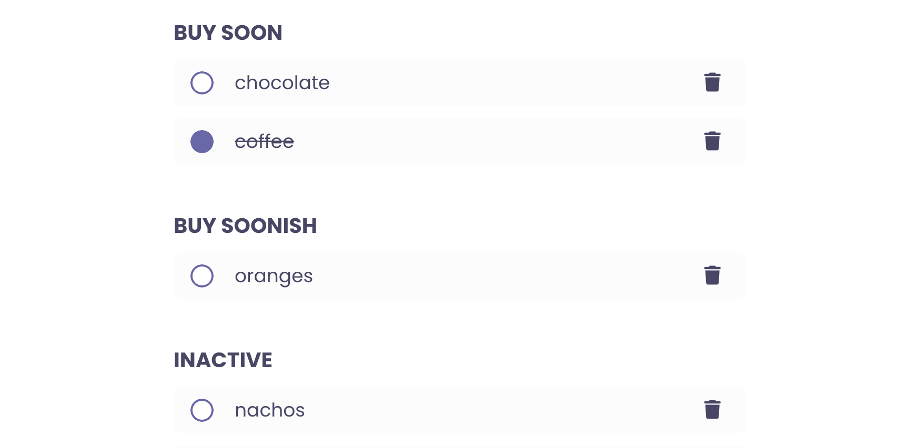
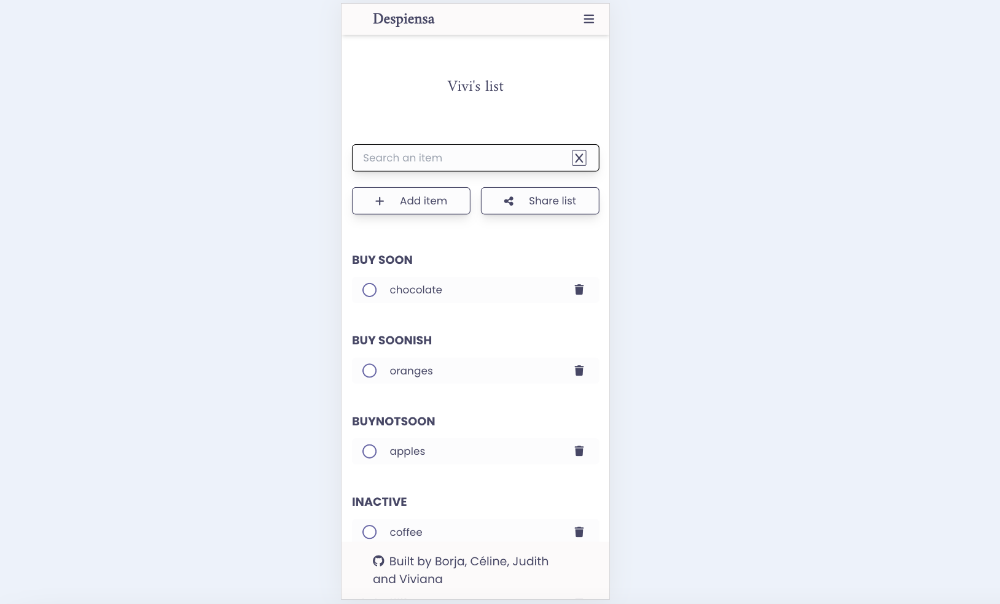
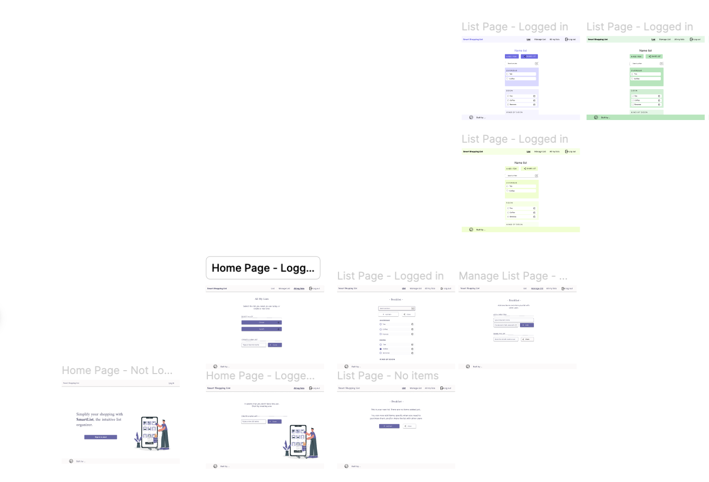

## Tech Stack
This project was built using React for the frontend and Firebase for user authentication and data storage. During the final phase, we integrated Tailwind as the CSS framework to style the app. I also contributed to the app's user interface design using Figma.

## Details and Main Features
Despiensa is a wordplay on the Spanish words despensa and piensa.

It's a web app that allows users to register and create shopping lists, which they can also share with other users.

The app also records the user's buying habits, so it displays the list items ordered by their likely next purchase date.

An email account is all that's needed to start using Despiensa. Once registered and signed in via Google, users can begin creating lists, adding items, and sharing their lists with others. 

The main features the team worked on include:

- User login

- Create/delete lists

- Add/delete items to lists

- Filter items

- Share lists with other registered users

## Motivation
[The Collab Lab](https://the-collab-lab.codes/) supports early-career developers by offering an environment for gaining practical experience through remote collaboration on real-world projects as part of an agile team.

This project is the result of cohort TCL-71, where I had the opportunity participate and collaborate with [Celine](https://github.com/ocsiddisco), [Borja](https://github.com/borjaMarti), and [Judith](https://github.com/BikeMouse).

## Development & Challenges
The most interesting part of this project was collaborating with other developers and mentors. We started in February with a basic React and Firebase project structure, and by April, we had a fully functional, responsive web app. Throughout the process, we took charge of implementing features and designing the interface.

We used GitHub to track project progress, creating and assigning issues.
The most challenging ones involved computing the need and buy frequency of items to properly order them in the list.

One thing I loved was how committed the team was to building an accessible app. We ensured to correctly label inputs, ensure full keyboard navigation, and maintain a color palette with sufficient contrast.
We also made sure the app was fully responsive and easy to navigate across different devices.

Once the core functionality was complete, we transitioned to the styling phase, using Figma to create a mood board and refine the app’s design.

## Highlighted learnings
Participating in The Collab Lab was a great learning experience. While I already had some experience with React, this was the perfect opportunity to deepen my understanding of core concepts.

In addition to the technical challenges we worked on as a team, we took full ownership of the project by creating issues, assigning tasks, and reviewing each other's work. This experience helped me gain confidence in explaining and presenting my work, as well as discussing solutions collaboratively.

I consistently documented the issues I worked on, shared what I learned along the way, and posted [a blogpost series](https://dev.to/vivitt/series/26359) with regular updates about our team’s progress.