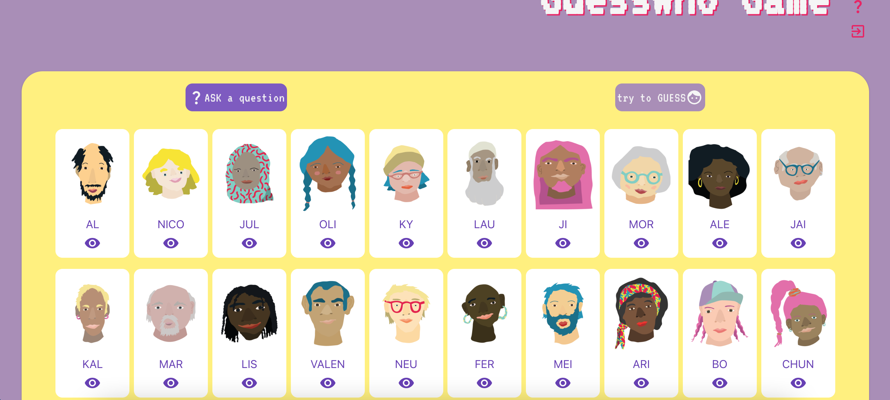

## Tech Stack
This project was created with React & Firebase to handle user authentication and data storage.
During the final styling phase, the team decided to use Tailwind as CSS framework. Also, contributed using Figma to create desing mokups and desing inpiration.

## Details and Main Features

A smart shopping list app that learns users' buying habits and helps them remember what they are likely to need to buy on their next trip to the store.
This game involves guessing a random character by asking questions about their visible features. To add more fun and improve the overall experience, players can also:

- Choose an avatar

- Select easy or hard mode, with a maximum number of questions and attempts allowed

- Turn sound effects on or off

- Compose any question by combining one or two inputs

- Discard cards by simply clicking on them

- Get a detailed view of a character

- See how long it took them to guess correctly

## Motivation
[The Collab Lab](https://the-collab-lab.codes/) supports early-career developers by providing an environment to gain practical experience through remote collaboration on real-world projects as part of an agile team.

This project is the result of the TCL-71 participation and was developed by [Celine](https://github.com/ocsiddisco), [Borja](https://github.com/borjaMarti), [Judith](https://github.com/BikeMouse), and [Viviana](https://github.com/vivitt).

We worked on this application from February to early April 2024, using React, Tailwind, and Firebase, with Figma employed to create our app's views.

## Development & Challenges
During development, I first focused on implementing the game logic. I wanted users to be able to formulate any question they wanted, so I couldn’t rely on pre-made questions.

To achieve this, I implemented a solution that combines two select inputs, one of them mandatory and the other optional. So users have the flexibility to create questions that match what they want to ask.

Another important feature was ensuring that users could manually turn down cards instead of the game doing it for them. This added an extra layer of difficulty to the game. To achieve this, I needed to track the current state of the cards throughout a play session, which pushed me to learn more about React state management.

In this project, I was involved not only in coding but also in designing the entire interface. So, once the logic was implemented, the next step was to determine how to display the information on the screen.

The first step was to choose a color palette that complemented the tones of the illustrations:

One of the most significant challenges was displaying many picture cards on the screen while ensuring all characters were visible. I learned about CSS Flexbox and used it to make the cards adapt to different screen sizes.

To make the most of the available space, I used toggleable panels and modular components that users can show or hide as needed. I also customized Material UI components to better fit the project’s design and ensure they complemented the color palette and illustrations.

## Highlighted learnings
As my first self-guided project, this experience came with both challenges and valuable learning opportunities.

I expanded my understanding of React functional components and hooks, becoming more comfortable installing and working with various packages and libraries. I also learned the importance of maintaining a well-structured project and being mindful of each line of code, refactoring when needed to keep things clean and maintainable.

### Links
[GitHub repo](https://github.com/vivitt/despiensa-smart-shopping-list)

[Live demo](https://www.despiensa.site/)

### Motivation

### Details and Main Features
The game involves guessing a random character by asking questions about their visible features. 

- Choose an avatar
- Choose easy or hard mode, wiht a maximum number of questions and attempts allowed
- Turn sound effects on or off
- Compose any question by combining one or two inputs
- Discard cards by simply clicking on them
- Get a detailed view of a character
- Know how long it took them to solve the guess

### Development, Challenges and Learnings
As my first self-guided project, it presented several challenges and learning opportunities.

I expanded my knowledge of React functional components and hooks, and became comfortable installing and using various packages and libraries.

I also took charge of designing the entire interface, choosing a color palette that complements the tones of the illustrations:

![../../images/projects/colors.png]

One of the most significant challenges was displaying a lot of picture cards on the screen to show all the characters. I learned about CSS Flexbox and used it to adapt the cards to different screen sizes.

To maximize the use of available space, I took advantage of toggleable panels and modular components that can be shown or hidden as needed by users. I also customized Material UI components to fit my needs and match the color palette, ensuring it complemented the tones of the illustrations.

