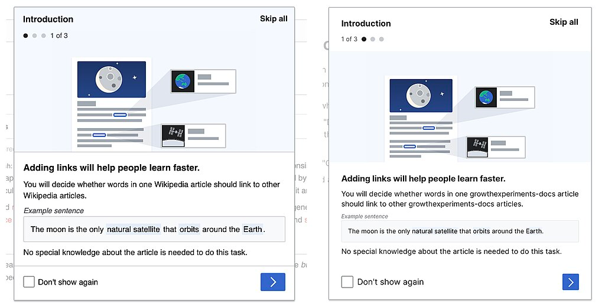

## Project details & Challenges
After graduating from bootcamp, I was thrilled to had been selected to join the Wikimedia Foundation as one of eight interns for the 2023 Software Engineering Internship Program.

I joined the Growth team to work on a project aimed at increasing the adoption of Vue.js within Growth’s features. Over the 16-week program, I contributed to modernizing selected object oriented JavaScript interfaces, refactoring them using Vue.js and the [Wikimedia Design System Codex](https://doc.wikimedia.org/codex/main/).

For this project, I worked in an isolated development environment using a [VitePress](https://vitepress.dev/) app, where I could prototype and test my components.

My first task was to refactor the “Add a link” dialog. I started by developing a new version of this dialog using Vue and Codex.

The main challenge was that the existing dialog component in Wikimedia’s Codex didn't allow to implement all the design specifications for my use case. 
My project involved a lot of cross team collaboration, to determine wheter if I should create a new component or if I should work on an extension of the existing one. 
my project played a key role in testing how the Wikimedia Design System adapts to different use cases. My use case led to the implementation of a Component Pattern and it further inclusion at Wikimedia Design System Codex docs: https://doc.wikimedia.org/codex/latest/components/demos/dialog.html#multi-step-dialog
This led to a disscusion to determine whether it was needed to be a new component or an extension of the existing one. In the end, I had the chance to implement a new component pattern that extended the existing one and addressed the requirements for my use case.
I also had the opportunity to document and share the process in a blog post, where I walk through the implementation and the main challenges I faced.

I also published a blog post that shared useful information for Wikimedia staff, helping distribute Wikimedia technologies to a broader audience: https://diff.wikimedia.org/2023/06/13/how-to-create-your-own-reusable-dialog-with-codex/

## Highlighted learnings
Completing this was most of all a great learning experience.
Beyond the technical challenges specific to my project, this experience gave me the opportunity to take part in code reviews, adapt to code conventions and best practices, and contribute effectively as part of a remote team.
I also had the chance to work within a large, complex codebase, which helped me get more comfortable navigating unfamiliar code and breaking it down to understand how everything fits together.
I had the chance to see how other people work and share pairing sessions with experienced engineers, improving my understanding of what good code is.